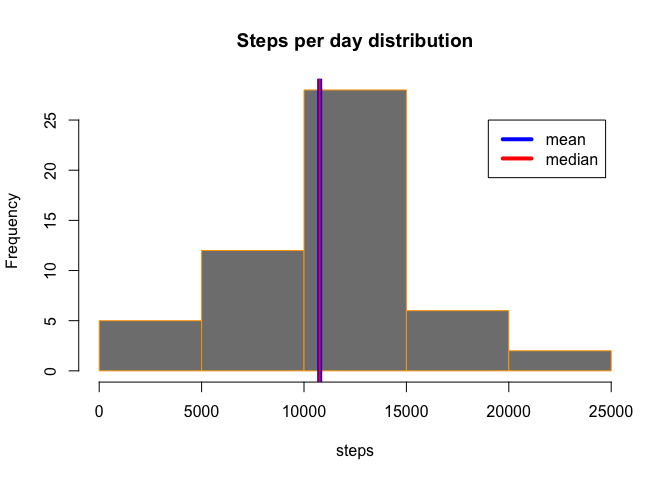
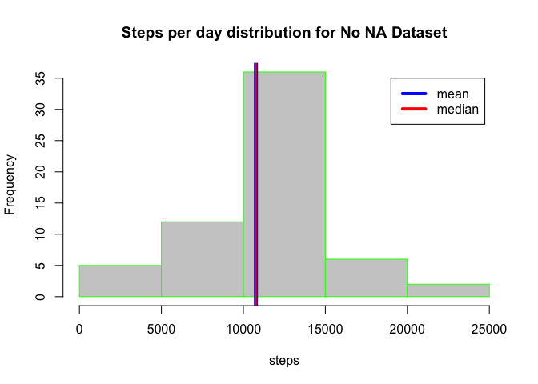
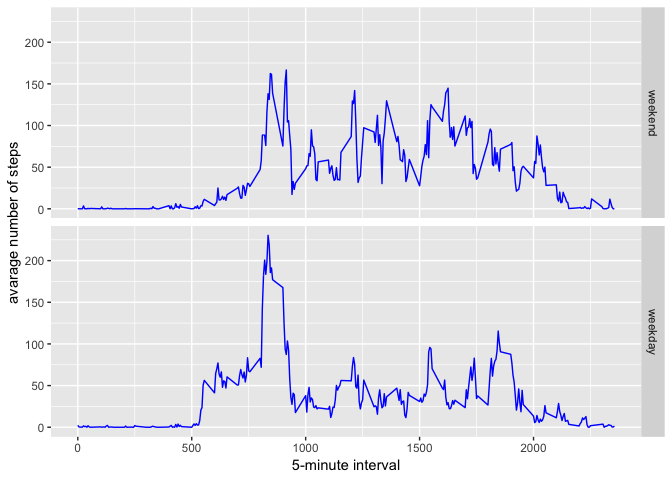

## Loading and preprocessing the data

```r
activity = read.csv('activity.csv')
str(activity)
```

```
## 'data.frame':	17568 obs. of  3 variables:
##  $ steps   : int  NA NA NA NA NA NA NA NA NA NA ...
##  $ date    : Factor w/ 61 levels "2012-10-01","2012-10-02",..: 1 1 1 1 1 1 1 1 1 1 ...
##  $ interval: int  0 5 10 15 20 25 30 35 40 45 ...
```

#### Overview

```r
summary(activity)
```

```
##      steps                date          interval     
##  Min.   :  0.00   2012-10-01:  288   Min.   :   0.0  
##  1st Qu.:  0.00   2012-10-02:  288   1st Qu.: 588.8  
##  Median :  0.00   2012-10-03:  288   Median :1177.5  
##  Mean   : 37.38   2012-10-04:  288   Mean   :1177.5  
##  3rd Qu.: 12.00   2012-10-05:  288   3rd Qu.:1766.2  
##  Max.   :806.00   2012-10-06:  288   Max.   :2355.0  
##  NA's   :2304     (Other)   :15840
```


```r
head(activity)
```

```
##   steps       date interval
## 1    NA 2012-10-01        0
## 2    NA 2012-10-01        5
## 3    NA 2012-10-01       10
## 4    NA 2012-10-01       15
## 5    NA 2012-10-01       20
## 6    NA 2012-10-01       25
```


```r
tail(activity)
```

```
##       steps       date interval
## 17563    NA 2012-11-30     2330
## 17564    NA 2012-11-30     2335
## 17565    NA 2012-11-30     2340
## 17566    NA 2012-11-30     2345
## 17567    NA 2012-11-30     2350
## 17568    NA 2012-11-30     2355
```

#### Interval ID pattern

If we look at interval ID, we can find pattern how ID depends on time of the day in 24 hour format.

```r
unique(activity$interval)
```

```
##   [1]    0    5   10   15   20   25   30   35   40   45   50   55  100  105
##  [15]  110  115  120  125  130  135  140  145  150  155  200  205  210  215
##  [29]  220  225  230  235  240  245  250  255  300  305  310  315  320  325
##  [43]  330  335  340  345  350  355  400  405  410  415  420  425  430  435
##  [57]  440  445  450  455  500  505  510  515  520  525  530  535  540  545
##  [71]  550  555  600  605  610  615  620  625  630  635  640  645  650  655
##  [85]  700  705  710  715  720  725  730  735  740  745  750  755  800  805
##  [99]  810  815  820  825  830  835  840  845  850  855  900  905  910  915
## [113]  920  925  930  935  940  945  950  955 1000 1005 1010 1015 1020 1025
## [127] 1030 1035 1040 1045 1050 1055 1100 1105 1110 1115 1120 1125 1130 1135
## [141] 1140 1145 1150 1155 1200 1205 1210 1215 1220 1225 1230 1235 1240 1245
## [155] 1250 1255 1300 1305 1310 1315 1320 1325 1330 1335 1340 1345 1350 1355
## [169] 1400 1405 1410 1415 1420 1425 1430 1435 1440 1445 1450 1455 1500 1505
## [183] 1510 1515 1520 1525 1530 1535 1540 1545 1550 1555 1600 1605 1610 1615
## [197] 1620 1625 1630 1635 1640 1645 1650 1655 1700 1705 1710 1715 1720 1725
## [211] 1730 1735 1740 1745 1750 1755 1800 1805 1810 1815 1820 1825 1830 1835
## [225] 1840 1845 1850 1855 1900 1905 1910 1915 1920 1925 1930 1935 1940 1945
## [239] 1950 1955 2000 2005 2010 2015 2020 2025 2030 2035 2040 2045 2050 2055
## [253] 2100 2105 2110 2115 2120 2125 2130 2135 2140 2145 2150 2155 2200 2205
## [267] 2210 2215 2220 2225 2230 2235 2240 2245 2250 2255 2300 2305 2310 2315
## [281] 2320 2325 2330 2335 2340 2345 2350 2355
```

For example, 0 - is 5 minutes intrval from 00:00 to 00:05.  
2355 - is the last 5 minutes interval from 23:55 to 00:00 next day.


## What is mean total number of steps taken per day?


```r
dailySteps <- aggregate(steps ~ date, data = activity, FUN=sum,na.rm=T)
theMean <- mean(dailySteps$steps,na.rm=T)
theMedian <- median(dailySteps$steps,na.rm=T)
hist(dailySteps$steps, xlab="steps",ylab="Frequency",
     main="Steps per day distribution",border='orange',col="gray50")
abline(v = theMean, col = "blue", lwd = 5)
abline(v = theMedian, col = "red", lwd = 2)
legend(19000, 25, c('mean','median'), lwd=4, col=c("blue", "red"))
```

<!-- -->


```r
summary(dailySteps)
```

```
##          date        steps      
##  2012-10-02: 1   Min.   :   41  
##  2012-10-03: 1   1st Qu.: 8841  
##  2012-10-04: 1   Median :10765  
##  2012-10-05: 1   Mean   :10766  
##  2012-10-06: 1   3rd Qu.:13294  
##  2012-10-07: 1   Max.   :21194  
##  (Other)   :47
```

So Mean is **10766.19** and Median is **10765**


## What is the average daily activity pattern?

#### What is average number of steps taken, averaged across all days?


```r
fiveMinSteps <- aggregate(steps ~ interval, data = activity, FUN=mean, na.rm=T)
plot(steps~interval,data=fiveMinSteps,type="l")
```

<!-- -->

#### Which 5-minute interval, on average across all the days in the dataset, contains the maximum number of steps?

```r
maxInterval <- fiveMinSteps[which.max(fiveMinSteps$steps),]
maxInterval
```

```
##     interval    steps
## 104      835 206.1698
```

**835's**  5-minute interval, on average across all the days in the dataset, contains the maximum number of steps. And steps values is **206.1698113**

Which means that maximum average activity was **at 08:35 - 08:40 in the morning**.

## Imputing missing values

####  Calculate total number of NA's 

There are several ways to do it:

  * summary function 

```r
  summary(activity)
```

```
##      steps                date          interval     
##  Min.   :  0.00   2012-10-01:  288   Min.   :   0.0  
##  1st Qu.:  0.00   2012-10-02:  288   1st Qu.: 588.8  
##  Median :  0.00   2012-10-03:  288   Median :1177.5  
##  Mean   : 37.38   2012-10-04:  288   Mean   :1177.5  
##  3rd Qu.: 12.00   2012-10-05:  288   3rd Qu.:1766.2  
##  Max.   :806.00   2012-10-06:  288   Max.   :2355.0  
##  NA's   :2304     (Other)   :15840
```
  * sum function

```r
  sum(is.na(activity$steps))
```

```
## [1] 2304
```
In both cases Total NA's number is 2304.


####  Create new Dataset with NA's filled in.


```r
df <- activity
df$steps[is.na(df$steps)] <- aggregate(steps ~ interval, data = df, FUN=mean,na.rm=T)$steps
summary(df)
```

```
##      steps                date          interval     
##  Min.   :  0.00   2012-10-01:  288   Min.   :   0.0  
##  1st Qu.:  0.00   2012-10-02:  288   1st Qu.: 588.8  
##  Median :  0.00   2012-10-03:  288   Median :1177.5  
##  Mean   : 37.38   2012-10-04:  288   Mean   :1177.5  
##  3rd Qu.: 27.00   2012-10-05:  288   3rd Qu.:1766.2  
##  Max.   :806.00   2012-10-06:  288   Max.   :2355.0  
##                   (Other)   :15840
```

There is no NA's compared to initial dataset and max value is Daily mean.

Initial dataset:

```r
summary(activity)
```

```
##      steps                date          interval     
##  Min.   :  0.00   2012-10-01:  288   Min.   :   0.0  
##  1st Qu.:  0.00   2012-10-02:  288   1st Qu.: 588.8  
##  Median :  0.00   2012-10-03:  288   Median :1177.5  
##  Mean   : 37.38   2012-10-04:  288   Mean   :1177.5  
##  3rd Qu.: 12.00   2012-10-05:  288   3rd Qu.:1766.2  
##  Max.   :806.00   2012-10-06:  288   Max.   :2355.0  
##  NA's   :2304     (Other)   :15840
```


####  Build new histogram and compare with initial

```r
dailyStepsNoNA <- aggregate(steps ~ date, data = df, FUN=sum,na.rm=T)
theMeanNoNA <- mean(dailyStepsNoNA$steps,na.rm=T)
theMedianNoNA <- median(dailyStepsNoNA$steps,na.rm=T)
hist(dailyStepsNoNA$steps, xlab="steps",ylab="Frequency",
     main="Steps per day distribution for No NA Dataset",border='green',col="grey80")

abline(v = theMeanNoNA, col = "blue", lwd = 5)
abline(v = theMedianNoNA, col = "red", lwd = 2)
legend(19000, 35, c('mean','median'), lwd=4, col=c("blue", "red"))
```

<!-- -->


#### Do these values differ from the estimates from the first part of the assignment? 

```r
summary(dailyStepsNoNA)
```

```
##          date        steps      
##  2012-10-01: 1   Min.   :   41  
##  2012-10-02: 1   1st Qu.: 9819  
##  2012-10-03: 1   Median :10766  
##  2012-10-04: 1   Mean   :10766  
##  2012-10-05: 1   3rd Qu.:12811  
##  2012-10-06: 1   Max.   :21194  
##  (Other)   :55
```

#### What is the impact of imputing missing data on the estimates of the total daily number of steps?

Number of days with mean steps increased upto 35.

Mean is **10766.19** and Median is **10766.19**. So they became equal.


## Are there differences in activity patterns between weekdays and weekends?

#### Add new factor to dataset

factor wd - lables if day is weekday or weekend


```r
df$dayType <- factor((weekdays(as.Date(df$date)) %in% c('Saturday','Sunday')), levels=c(TRUE,FALSE), labels=c('weekend', 'weekday'))
df$weekday <- weekdays(as.Date(df$date))
head(df)
```

```
##       steps       date interval dayType weekday
## 1 1.7169811 2012-10-01        0 weekday  Monday
## 2 0.3396226 2012-10-01        5 weekday  Monday
## 3 0.1320755 2012-10-01       10 weekday  Monday
## 4 0.1509434 2012-10-01       15 weekday  Monday
## 5 0.0754717 2012-10-01       20 weekday  Monday
## 6 2.0943396 2012-10-01       25 weekday  Monday
```

#### Plot time series 

```r
fiveMinStepsWd <- aggregate(steps ~ interval + dayType, data = df, FUN=mean, na.rm=T)
library(ggplot2)
ggplot(fiveMinStepsWd, aes(interval, steps)) + 
        geom_line(color="blue")+ 
        facet_grid(dayType ~ .) +
        xlab("5-minute interval") + 
        ylab("avarage number of steps")
```

<!-- -->
